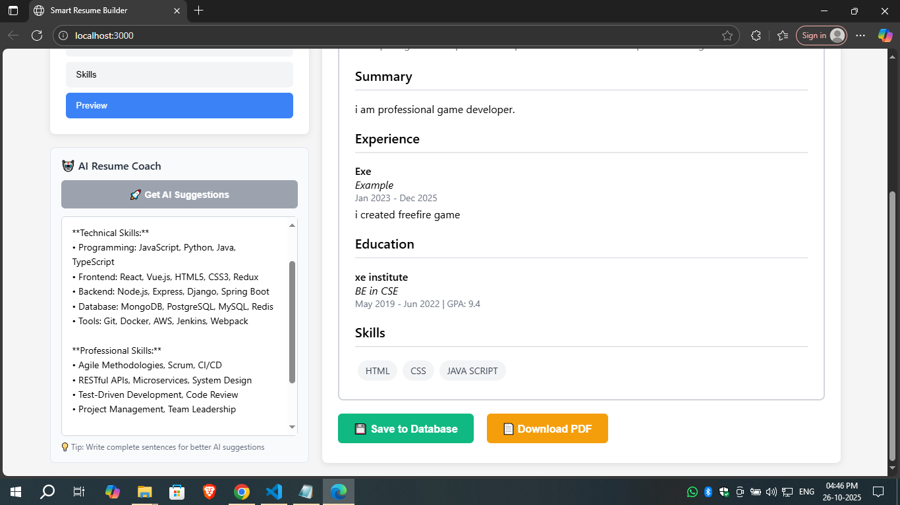
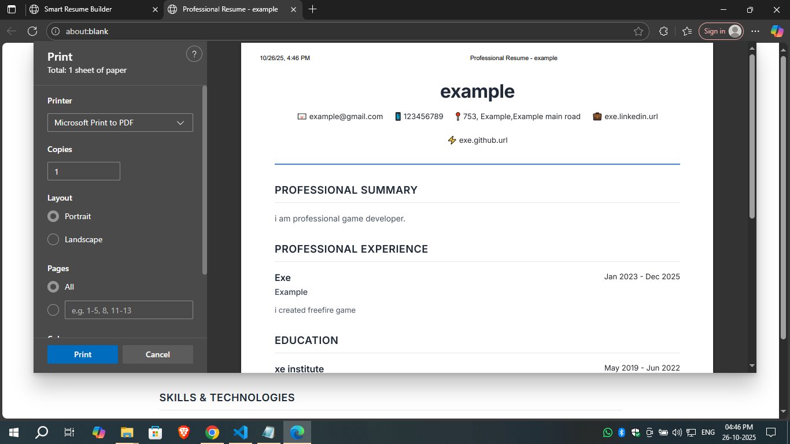
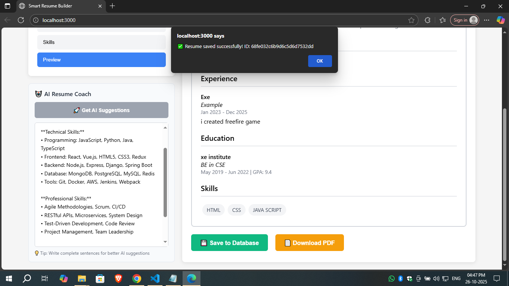
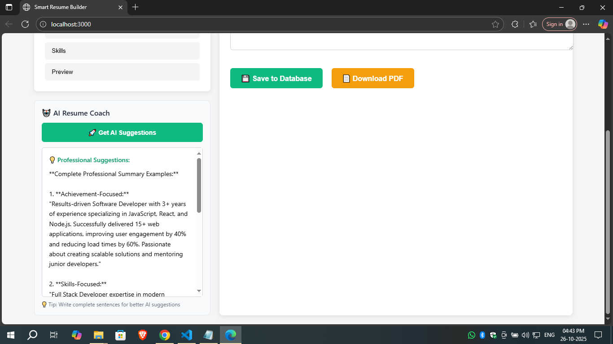

# 🧠 Smart Resume Builder with AI Suggestions

A **full-stack AI-powered Resume Builder** that helps users create professional resumes with **OpenAI integration** for smart suggestions and **MongoDB Atlas** for secure data storage.

---

## 🚀 Features

- ✨ AI-based resume improvement suggestions (powered by OpenAI)
- 💾 Save and retrieve user data from MongoDB Atlas
- 🧩 Simple, clean UI built with React and TailwindCSS
- 📄 Generate downloadable PDF resumes
- 🔐 Secure backend with environment variables

---

## ⚙️ Prerequisites

Make sure you have the following installed before starting:

1. **Node.js** (v14 or higher)  
   👉 [Download here](https://nodejs.org)  
   Verify installation:  
   ```bash
   node --version
2. Required Accounts
  - MongoDB Atlas – for database
  - OpenAI Platform – for AI features

## 📄 Setup

### 🔑 Step 1: Get Your API Keys

#### I. 🟢 MongoDB Connection String

1. Visit MongoDB Atlas

2. Create a Free Cluster

3. Click Connect → Connect your application

4. Copy the connection string
Example:
 ```bash
mongodb+srv://username:<password>@cluster0.xxxxx.mongodb.net/?retryWrites=true&w=majority
```
#### II. 🟣 OpenAI API Key

1. Go to OpenAI Platform

2. Login → Click your profile → View API Keys

3. Click Create new secret key

4. Copy the key (starts with sk-) and store it safely

### 📦 Step 2: Download the Project
1. Clone this repository
git clone https://github.com/nagarajNaik2005/Smart-Resume-Builder-with-AI-Suggestions.git

2. Go to project folder
cd Smart-Resume-Builder-with-AI-Suggestions

### 🖥️ Step 3: Backend Setup:
```bash
cd backend
npm install
```
- Now, create a .env file inside the backend folder and add the following:
```bash
  MONGODB_URI=your_actual_mongodb_connection_string_here
  OPENAI_API_KEY=your_actual_openai_api_key_here
  PORT=5000
```
- Start the backend server:
  ```bash
  npm run dev
  ```
- If successful, you’ll see:
  ```bash
  Server running on port 5000
  MongoDB Connected
  ```
### 🌐 Step 4: Frontend Setup
```bash
  cd frontend
  npm install
  npm start
  ```
- Your app should open automatically at:
  👉 <http://localhost:3000>
  
### 🧩 Step 5: Verify Installation
  | Feature            | Expected Behavior            |
  | ------------------ | ---------------------------- |
  | Fill personal info | Saves locally                |
  | Get AI Suggestions | Returns real AI-based advice |
  | Save to Database   | Stores data in MongoDB       |
  | Download PDF       | Opens print/download dialog  |

### 🛠️ Troubleshooting
#### 1. 🔵 OpenAI Issues

  - Invalid API Key: Check .env file

  - Insufficient Credits: Add payment method

  - Rate Limited: Wait a few minutes and retry
#### 2. 🟢 MongoDB Issues

  - Authentication failed: Recheck username/password

  - Network timeout: Check internet

  - IP not whitelisted: → Go to MongoDB Atlas → Network Access → Add IP (0.0.0.0/0)

### 💰 Cost Information
| Service       | Plan                                | Notes                                    |
| ------------- | ----------------------------------- | ---------------------------------------- |
| MongoDB Atlas | FREE Tier                           | 512MB storage                            |
| OpenAI        | FREE Tier ($5 credits for 3 months) | Then pay-as-you-go (~$0.002 per request) |

### 🚀 Quick Start Commands
```bash
# Terminal 1 - Backend
cd backend && npm run dev

# Terminal 2 - Frontend
cd frontend && npm start
```
### ✅ Success Checklist
   Backend running on http://localhost:5000

  - Frontend running on http://localhost:3000

  - AI Suggestions working

  - MongoDB connected

  - PDF generation functional

  - No console errors

### ⚠️ Security Reminder
  - 🚫 Never share your .env file

  - 🚫 Never commit API keys to GitHub

  - ✅ Always use environment variables for sensitive data

<h3 align="center">📸 Preview</h3>

<p align="center">
  
  
</p>

<p align="center">
  
  
</p>

<p align="center">
  
</p>

### 🧑‍💻 Author
Nagaraj Naik
💼 Engineering Student | 💡 Aspiring Full Stack Developer
📧 [Email](mrnagarajnaik2005@gmail.com) |
    [LinkedIn](https://www.linkedin.com/in/nagaraj-naik-2995852ba)
   
### 📝 License
 All Rights reserved.

 ---
 ⭐ If you found this project helpful, give it a star on GitHub! ⭐
 ---
